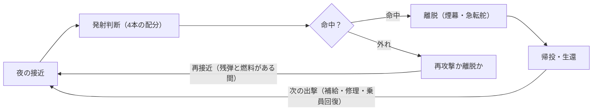

# WWII魚雷艇ゲーム 史実リサーチ＆設計資料

- 作成日: 2026-10-01（Claude Docs版をMarkdownに再構成、2026-10-02）
- 版: v0.1.0（docs）
- 用途: ゲームの数値設計・ミッション設計・バランス調整の根拠。数値は `data/*.json` に転記済み。
- 注意: 「未確認」と書いた項目は裏が取れていない。ゲームの数値に使う場合は「提案値」として扱う。

---

## 0. 結論：ゲームに効く史実5点

魚雷艇戦の史実は「魚雷は当たらず、敵以外の理由で沈む」に尽きる。ゲームの核は接近・発射判断・離脱・生還に置く。

1. **魚雷は当たらない武器だった。** 米PTはブラケット海峡（1943年8月1〜2日）で15隻・約30本を撃って命中ゼロ、スリガオ海峡（1944年10月25日）は35本で日本側確認は軽巡阿武隈への1本だけ。Sボートの戦果数値も戦果報告ベースで、ドイツの歴史海事アーカイブが原典の誤りを多数指摘している。
2. **損失の約65%は敵以外。** 米公刊史の損失69隻のうち座礁20、友軍誤射7、港内火災6、衝突事故3、暴風3。敵の直接攻撃は24隻（35%）。
3. **速度・夜間視界・燃料のトレードオフ。** Sボートはディーゼルで40kt超、航続700nm超、艇尾波が小さい。PT/MTBはガソリンで40kt、火災リスクが高く航続が短い。
4. **日本の魚雷艇はエンジン不足で20〜30ktが大半。** 米艦船への戦果は本調査では1件も確認できなかった。
5. **任務は多様。** 大発掃討、要人脱出、閘門爆破、特攻艇迎撃、工作員輸送など、ミッション素材は豊富。

---

## 1. 確定した設計判断（2026-10-01）

| 論点 | 判断 | 状況 | 理由 |
| --- | --- | --- | --- |
| 日本側キャンペーン | 弱者視点（回避・輸送・隼艇の護衛・生還が目的）のハードモードとして実装 | 確定 | 史実では速力劣勢・出撃前に空襲で喪失が多く、通常モードでは成立しない |
| 魚雷の命中率 | 「当たらない魚雷」はコンセプトに残すが、史実忠実には寄せず爽快感側に傾ける | 確定 | 史実値（数%）をそのまま使うと面白さが失われる |
| 主軸キャンペーン | 米PT（Elco 80ft）を最有力候補としてプロトタイプで検証 | 推奨（未確定） | 資料量・ミッションの多様性・数値の揃い方で最も設計しやすい |
| 技術スタック | Phaser 3 + TypeScript + Vite（PWA先行、App StoreはCapacitor） | 確定（2026-10-02） | 開発環境がWindowsのみ。iPhone Safariで即テストできる |

---

## 2. 各国の呼称と位置づけ

魚雷艇は6か国で性格が大きく違い、ゲームでは「国＝プレイスタイル」になる。

| 国 | 呼称 | 代表艇 | 主戦域 | 特徴 |
| --- | --- | --- | --- | --- |
| 米 | PT boat（Patrol Torpedo） | Elco 80ft、Higgins 78ft | ソロモン・ニューギニア・フィリピン・地中海・英仏海峡 | ガソリン、重武装化、レーダー搭載が早い |
| 独 | Schnellboot（S-Boot。英呼称E-boat） | S-38級、S-100級 | 英仏海峡・北海・地中海・黒海・バルト海 | ディーゼル、長航続、装甲艇橋、レーダー無し |
| 英 | MTB／MGB／Fairmile D | Vosper 70ft、Fairmile D「Dog Boat」 | 海峡・北海・地中海・ノルウェー沿岸 | MGB（砲艇）とMTB（雷撃艇）の役割分担 |
| 日 | 魚雷艇（乙型・甲型）、隼艇 | T-14型、T-38型、甲型T-51 | ソロモン・フィリピン・沖縄 | エンジン不足で劣速、空襲で出撃前に喪失が多い |
| 伊 | MAS／MS | MAS 500系、MS（CRDA 60t） | 地中海・紅海・黒海 | 45kt級の高速。第一次大戦で戦艦を沈めた実績 |
| ソ | トルペードヌィ・カーテル | G-5、D-3 | 黒海・バルト・北極・1945年対日 | G-5は50kt級だが後方投下式で海況に弱い |

**日本語の用語注意**：魚雷艇（20〜90t級の小型艇）と水雷艇（千鳥型・鴻型、600〜800t級の艦艇）は別物。隼艇は乙型船体から魚雷を外して機銃を増備した砲艇。雷艇は速力不足で雑役船扱いになった艇。震洋は魚雷艇の船型を元にした特攻艇（6,197隻）。

---

## 3. 艇スペック比較

速力は各国とも40kt前後で横並び。差が出るのは航続・燃料の種類・乗員数・魚雷の本数で、ここがゲームの国別パラメータになる。日本艇の型別詳細は§8の表を参照。

| 艇 | 全長 | 排水量 | 機関 | 速力 | 航続 | 乗員 | 魚雷 | 砲・機銃 | 建造数 |
| --- | --- | --- | --- | --- | --- | --- | --- | --- | --- |
| 米 Elco 80ft | 24.4m | 40〜56t | Packard 4M-2500×3（1,200→1,350→1,500hp） | 設計40kt超、実用30kt台後半 | 100オクタン3,000gal、行動半径500nm要求 | 12〜17 | 53.3cm Mk 8×4→1943年半ばからMk 13×4（ラック式） | 12.7mm連装×2、20mm、37mm、40mm、ロケット | 326（米PT全体531） |
| 米 Higgins 78ft | 23.8m | 未確認 | 同上 | 約40kt。Elcoより旋回性良 | 同上 | 同上 | 同上 | 同上 | 199 |
| 英 Vosper 73ft | 22.3m | 47t | Packard×3 4,200hp | 40kt | 470nm@20kt | 13 | 18in×4（Mk XV） | 20mm×2、6pdr | Vosper社全体で約350 |
| 英 Fairmile D | 35m | 102〜118t | Packard×4 5,000hp、燃料5,200gal | 29kt | 506nm全速／2,000nm@11kt | 21 | 18in×4 or 21in×2 | 6pdr×2、2pdr、20mm | 228 |
| 独 S-100級 | 34.9m | 100〜117t | MB 501→MB 511×3（6,000→7,500PS） | 39〜42kt（MB 518搭載艇は45kt） | 700〜750nm | 21〜24 | 53.3cm発射管2＋予備2（G7a） | 20mm、37mm/40mm、後期30mm連装×3 | Sボート全体191〜250（資料差） |
| 独 S-30級 | 32.8m | 81〜100t | MB 502×3 3,960shp | 36kt | 800nm@30kt | 21〜30 | 2＋2 | 20mm×3、37mm | 16 |
| 日 T-38型（乙型） | 18.0m | 約20t | 金星41型×2 1,400hp | 27.5kt | 220nm@26kt | 7 | 45cm×2（舷側落射） | 25mm×1 | 74〜80 |
| 伊 MAS 500系 | 18m級 | 未確認 | Isotta Fraschini ASM 184 1,500hp | 最大45kt | 未確認 | 未確認 | 45cm×2 | 13.2mm×1 | 1940年時点48隻 |
| ソ G-5 | 18.85m | 14〜16t | GAM-34 675〜1,000hp×2 | 45〜56kt | 未確認 | 6〜7 | 53.3cm×2（艇尾の溝から後方投下） | 7.62→12.7mm | 約300 |
| ソ D-3 | 22.4m | 31t | GAM-34BS×3（後期Packard） | 32kt→1943型47kt | 未確認 | 未確認 | 53.3cm×2（側方投下） | 12.7mm×2 | 73 |

PTの燃料消費は23kt巡航で約200gal/h、全速で約500gal/h（巡航15時間・全速6時間に相当）。エンジン換装は600時間ごと。Elco 70ftは2.4〜3mの波で船底フレーム破損・外板亀裂が出た試験記録があり、海況制限の根拠になる。

出典: Bulkley Part II (https://www.ibiblio.org/hyperwar/USN/CloseQuarters/PT-2.html)、PT boat (https://en.wikipedia.org/wiki/PT_boat)、Fairmile D (https://en.wikipedia.org/wiki/Fairmile_D_motor_torpedo_boat)、E-boat (https://en.wikipedia.org/wiki/E-boat)、german-navy.de (https://www.german-navy.de/kriegsmarine/ships/fastattack/index.html)、navypedia T-38 (https://www.navypedia.org/ships/japan/jap_aux_t38.htm)、G-5級 (https://en.wikipedia.org/wiki/G-5-class_motor_torpedo_boat)、D3級 (https://en.wikipedia.org/wiki/D3-class_motor_torpedo_boat)

---

## 4. 魚雷の性能と航走時間

魚雷は1,500mを走るのに1〜2分かかり、ただし史実の実効発射距離は400〜1,000ydだった。駆逐艦が30ktで回避すると60秒で約930m動くので、扇状発射と見越し角がゲームの核心になる。

| 魚雷 | 弾頭 | 速力／射程 | 備考 |
| --- | --- | --- | --- |
| 米 Mk 8 Mod 3C/3D（PT初期） | 385〜466lb TNT（Mod差） | 27kt／13,500yd（navweapsとBulkleyが一致。Wikipediaの36kt／16,000ydは不一致） | 1911年設計。黒色火薬射出の不発→管内ホットラン、発射閃光とグリスの黒煙で位置露呈、最小深度約3mで大発の下を抜ける |
| 米 Mk 13（PT後期） | 600lb Torpex | 33.5kt／6,300yd（4,000yd説あり） | 航空魚雷の転用。ラックから静かに転落、軽量化分を砲に回した |
| 独 G7a（T1） | 280kg | 44kt／6,000m、40kt／8,000m、30kt／14,000m | 雷跡（気泡）が見える |
| 独 G7e（T3） | 280kg | 30kt／5,000〜7,500m | 無航跡・静音。予熱が必要。Sボート搭載を確認 |
| 英 18in Mk XV | 247kg Torpex | 40kt／2,500yd、33kt／3,500yd | MTB搭載は1943年〜 |
| 英 21in Mk VIII** | 365kg Torpex | 40〜45.5kt／5,000yd | Fairmile D等 |
| 日 45cm 四四式（後期） | 208kg | 35kt／3,000m、26kt／7,000m | 魚雷艇の搭載型式は未確認（四四式か二式か） |
| 伊 W 200／Si 170 | 200kg／170kg | 44kt／3,000m／41kt／4,000m | MAS搭載。MS艇は533mm管に縮径ケージで450mmを使用 |
| ソ 53-38 | 300kg | 44.5kt／3,900m、30.5kt／10,000m | G-5主用 |

航走時間の目安（1,000yd／1,500m／2,000m）: 27kt＝66／108／144秒、33.5kt＝53／87／116秒、40kt＝44／73／97秒、44kt＝40／66／88秒。Channel Dash（1942年2月12日）の4,000ydは「極限距離」で全弾外れた。

出典: navweaps 米魚雷 (http://www.navweaps.com/Weapons/WTUS_PreWWII.php)、独魚雷 (https://www.navweaps.com/Weapons/WTGER_WWII.php)、英魚雷 (https://www.navweaps.com/Weapons/WTBR_WWII.php)、ソ連魚雷 (http://www.navweaps.com/Weapons/WTRussian_WWII.php)、regiamarina.net (https://regiamarina.net/torpedoes/)、Japanese 45 cm torpedo (https://en.wikipedia.org/wiki/Japanese_45_cm_torpedo)、Mark 8 torpedo (https://en.wikipedia.org/wiki/Mark_8_torpedo)、Mark 13 torpedo (https://en.wikipedia.org/wiki/Mark_13_torpedo)

---

## 5. 運用・戦術の実像

各国共通で夜間出撃・昼間整備。戦術の違いは「何を狙ったか」であり、ミッションの色分けにそのまま使える。

**昼夜のサイクル**：PTの1出撃は薄暮〜翌朝のおよそ10〜12時間、2〜4隻単位。昼は陸上設備不足のため整備に当てた。Sボートは昼間はIJmuidenやBoulogneのブンカーで待避した。

**米PT**：低速で接近し、小さな煙幕を置きながら90度変針を繰り返して離脱。典型的な魚雷発射距離は400〜1,000yd。2,000ydでの試みは成果が乏しかった。1943年3月のビスマルク海海戦後は日本軍が大発輸送に依存したため「空軍が昼、PTが夜」の大発掃討に転換し、岸から200〜400ydを這って月間44〜55隻（1943年7〜12月）を撃破した。PBY「Black Cat」との夜間協同、SOレーダー（約17nm、1943年にほぼ全艇装備）が強み。日本軍水上機による夜間のPT狩りが常態化し、スクリューの夜光虫航跡が発見の手がかりになった。

**独Sボート**：初期は船団航路上で待ち伏せ（Lauertaktik）だが航空偵察がなく空振りが多く、1942年半ばから偵察情報に基づく突入（Stichansatz）へ。英東岸の船団航路襲撃と機雷敷設が主任務。レーダーは実戦配備されず（FuMO 71/72の試験艇は「先に見つかる」と酷評）、連合軍のレーダー・航空優勢で1943年以降の戦果が低下。補助舵を外振りする「リュールセン効果」で艇尾波を抑え、夜間に見えにくかった。

**英Coastal Forces**：MGBが予期しない方向から砲撃して護衛の注意を引き、その間にMTBが雷撃点へ機動する分業。1944年時点で士官3,000・兵22,000、艇約2,000。基地はFelixstowe、Dover、Lowestoft、Gosport（HMS Hornet）など。

**日本**：1942年秋以降、米PTのソロモン輸送妨害への対抗策として投入要求が出たが、木造合板船体が脆弱で出撃前に空襲で破壊される例が多く活躍は限定的。1943年の「2年で1,500隻」計画はエンジン不足で実績約500隻。

出典: Bulkley Part III (https://www.ibiblio.org/hyperwar/USN/CloseQuarters/PT-3.html)、Part IV (https://www.ibiblio.org/hyperwar/USN/CloseQuarters/PT-4.html)、schnellbootnet 戦域 (https://schnellbootnet.jimdofree.com/kriegsmarine-kriegsschaupl%C3%A4tze-i/)、navweaps 独レーダー (https://www.navweaps.com/Weapons/WRGER_09.htm)、Motor Gun Boat (https://en.wikipedia.org/wiki/Motor_Gun_Boat)、魚雷艇（大日本帝国海軍） (https://ja.wikipedia.org/wiki/魚雷艇_(大日本帝国海軍))

---

## 6. 主要海戦年表（ミッション素材）

1937年の上海から1945年のサマール焼却まで、ミッションになりうる戦闘を時系列で並べた。太字は魚雷艇が戦局を動かした例。

| 年月日 | 戦闘 | 概要 |
| --- | --- | --- |
| 1937年8月 | 上海 | 中国海軍のソーニクロフトCMBが第三艦隊旗艦「出雲」を雷撃（失敗）。日本の魚雷艇開発の転機 |
| 1940/5/23〜31 | ダンケルク | S-21/23が仏駆逐艦Jaguar雷撃、**S-30が英駆逐艦Wakeful撃沈**（兵640名中生存4名）、S-23/26が仏Siroco撃沈。英MTB 102はWake-Walker少将の旗艦に |
| 1941/4/8 | 紅海 | 伊MAS 213が英軽巡Capetownを雷撃損傷 |
| 1941/12〜42/4 | フィリピン | MTB Sqn 3（Bulkeley、6隻）。**1942/3/11〜13 PT-41がマッカーサーをコレヒドール→ミンダナオへ約560マイル脱出**。初期の「巡洋艦撃沈」報告は後に海軍自身が虚偽と認識 |
| 1942/2/12 | チャンネル・ダッシュ | ドーバーのMTB 5隻がSボート12隻×2列に阻まれ、命中なし |
| 1942/3/27〜28 | サン・ナゼール | MTB 74が遅延信管魚雷で閘門を雷撃。ML 16隻中12隻喪失、MGB 314の砲手SavageにVC |
| 1942/6/14〜15 | 地中海 | S-55が英駆逐艦Hasty撃沈、S-56（Wuppermann）が巡洋艦Newcastle雷撃 |
| 1942/8/13 | ペデスタル作戦 | **伊MS 16・MS 22が英軽巡Manchester（11,350t）を雷撃→自沈**。魚雷艇に沈められた最大の軍艦。MAS/MSが商船4隻も撃沈 |
| 1942/12/11〜12 | ガダルカナル | **PT-37・40（諸説）が駆逐艦照月に命中、爆沈**。PT-44喪失。照月の残骸は2025年7月にE/V Nautilusが発見 |
| 1943/2/1 | ケ号作戦 | PT 11隻が迎撃、PT-37・111・123喪失。巻雲はPT回避中に触雷沈没 |
| 1943/3/12 | チュニジア沖 | S-55（Horst Weber）が英駆逐艦Lightning撃沈 |
| 1943/4/12〜13 | ベルギー〜オランダ沿岸 | MGBのエースRobert Hichens戦死 |
| 1943/8/1〜2 | ブラケット海峡 | PT 15隻・約30本で命中ゼロ。**天霧がPT-109を切断**、ケネディら11名が泳いで島へ。Biuku Gasa・Eroni Kumanaのココナツ伝言で8/8救助 |
| 1943/10/24〜25 | クローマー沖 | 英駆逐艦WorcesterとMTB群がS-63・S-88を撃沈 |
| 1944/4/28 | Exercise Tiger（Lyme Bay） | **第5・第9 S戦隊9隻がLST-507・531を撃沈**、米軍死者749（639／946説あり） |
| 1944/6/6 | ノルマンディー | 第9 S戦隊がシェルブールから出撃し最大射程で発射して帰投。ノルウェー駆逐艦Svennerを沈めたのはSボートではなく第5水雷艇戦隊 |
| 1944/6/14 | ル・アーヴル空襲 | Sボート多数喪失（隻数は本調査で未確認） |
| 1944/8/8〜9 | ジャージー島沖 | PT-509が独掃海艇に衝突・爆発、生存1名 |
| 1944/10/10 | 沖縄・運天港 | 第27魚雷艇隊が空襲で18隻中13隻喪失 |
| 1944/10/24〜25 | スリガオ海峡 | **PT 39隻・13セクション**が初接触、35本発射で確認命中は阿武隈への1本（PT-137）。30隻が被弾圏、PT-493喪失 |
| 1944/12/11〜12 | オルモック湾 | **PT-490・492が駆逐艦卯月を撃沈**（日本側記録一致）。特攻でPT-323・300喪失 |
| 1945/1/10 | リンガエン湾 | 震洋がLCI(M)-974撃沈、4隻損傷（魚雷艇とは別枠） |
| 1945/2/14 | オステンド | 港内火災でカナダ29th MTB Flotilla 5隻・26名、英Fairmile D 4隻喪失 |
| 1945年11月 | サマール島Bobon Point | 米PT 118〜121隻を装備撤去のうえ焼却処分 |

出典: Bulkley Part I (https://www.ibiblio.org/hyperwar/USN/CloseQuarters/PT-1.html)、Part VIII (https://www.ibiblio.org/hyperwar/USN/CloseQuarters/PT-8.html)、PT-109 (https://en.wikipedia.org/wiki/Motor_Torpedo_Boat_PT-109)、Battle of Surigao Strait (https://en.wikipedia.org/wiki/Battle_of_Surigao_Strait)、Battle of Ormoc Bay (https://en.wikipedia.org/wiki/Battle_of_Ormoc_Bay)、照月 (https://en.wikipedia.org/wiki/Japanese_destroyer_Teruzuki_(1941))、NHHC 照月発見 (https://www.history.navy.mil/news-and-events/news/2025/Flagship-Imperial-Japanese-Naval-Destroyer-Teruzuki-Found.html)、HMS Wakeful (https://en.wikipedia.org/wiki/HMS_Wakeful_(H88))、HMS Lightning (https://en.wikipedia.org/wiki/HMS_Lightning_(G55))、HMS Manchester (https://en.wikipedia.org/wiki/HMS_Manchester_(15))、Exercise Tiger (https://en.wikipedia.org/wiki/Exercise_Tiger)、HNoMS Svenner (https://en.wikipedia.org/wiki/HNoMS_Svenner_(G03))、St Nazaire Raid (https://en.wikipedia.org/wiki/St_Nazaire_Raid)、Channel Dash (https://en.wikipedia.org/wiki/Channel_Dash)、29th MTB Flotilla (https://en.wikipedia.org/wiki/29th_Motor_Torpedo_Boat_Flotilla)、総務省 沖縄戦災（運天港） (https://www.soumu.go.jp/main_sosiki/daijinkanbou/sensai/situation/state/okinawa_34.html)、USN Chronology 1945 (https://www.ibiblio.org/hyperwar/USN/USN-Chron/USN-Chron-1945.html)

---

## 7. 戦績と損失の実像（バランス調整の根拠）

どの国も「戦果は報告値より小さく、損失は敵以外が多い」。ゲームのイベント発生重みは次の表の比率をそのまま使える（`data/risk_events.json` に転記済み）。

### 7.1 米PT損失69隻の原因別内訳（Bulkley『At Close Quarters』付録Bを本調査で集計）

| 原因 | 隻数 | 敵の直接攻撃か | 主な艇 |
| --- | ---: | --- | --- |
| 座礁（敵地での処分18を含む） | 20 | いいえ | 31,33,68,73,118,135,136,145,147,153,158,172,193,321,322,339,368,371／113,338 |
| 敵艦の砲撃・衝突 | 8 | はい | 37,43,44,111,112,493／109（被衝突）／509 |
| 敵航空機（特攻2を含む） | 7 | はい | 34,117,123,164,320／300,323 |
| 友軍誤射 | 7 | いいえ | 77,79（米艦）、121,353（豪機）、166,346,347（米機） |
| 港内火災・爆発 | 6 | いいえ | 63,107（Emirau）、67,119（Tufi）、239（Vella Lavella）、301（Mios Woendi） |
| 敵沿岸砲 | 5 | はい | 133,247,251,337,363 |
| 機雷 | 4 | はい | 202,218,311,555 |
| 衝突事故 | 3 | いいえ | 110,200,279 |
| 暴風 | 3 | いいえ | 22,28,219（アリューシャン） |
| 鹵獲防止の処分 | 3 | いいえ | 32,35,41 |
| 輸送中（タンカー被雷） | 2 | いいえ | 165,173 |
| 不明（敵砲か誤射か） | 1 | いいえ | 283 |
| **合計** | **69** | 敵の直接攻撃 24隻（35%） | |

座礁は敵地で艇を処分した18隻を含む。ゲームでは「航法ミス＝艇の喪失」が最大リスクになる。

### 7.2 各国の戦績サマリ

| 項目 | 数値 | 注意 |
| --- | --- | --- |
| 米PT 損失総数 | 69隻（Bulkley付録B集計）／99隻（Wikipedia） | 算入基準の差。公刊史の69を正とする |
| 米PTの確認戦果 | 駆逐艦照月（1942/12）、駆逐艦卯月（1944/12）、軽巡阿武隈に命中（撃沈は航空）、潜水艦伊3（1942/12/9、日本側照合未）、第105号哨戒艇（共同） | 実効は「PTの存在そのものがガ島への護衛付き補給を妨害した」こと |
| Sボート戦果（報告値） | 商船101隻214,728t、駆逐艦12、掃海艇11、揚陸艦8、MTB 6、潜水艦1。機雷で商船37隻148,535t | 歴史海事アーカイブが原典の誤りを多数指摘。Manchester撃沈をSボートとする記述は誤り |
| Sボート損失 | 約146隻。空襲≒45、機雷≒28、水上戦≒22、自沈≒18、事故≒12 | 要員7,500名中、戦死767・負傷620・捕虜322 |
| 英Coastal Forces | 約2,000隻、損失170隻、撃沈約400隻（うちSボート48）、魚雷1,169本発射、戦闘900回超 | Wikipedia単独ソース、要照合 |
| 日本魚雷艇 | 完成約500隻（隼艇含む）、未成含め約800隻 | 米艦船への戦果は公刊史・NHHCで1件も確認できず。震洋（6,197隻）はLCI(M)-974、PC-1129、LCS(L)-7、LSM-12、LCI(G)-82等を撃沈 |
| ソ連G-5 | 約300隻、1941/6/22保有254隻、戦没73 | バルト海での確認撃沈は2隻のみ（ソ連側請求との乖離） |

出典: Bulkley 付録B (https://www.ibiblio.org/hyperwar/USN/CloseQuarters/PT-B.html)、PT boat (https://en.wikipedia.org/wiki/PT_boat)、ww2db S-boat (https://ww2db.com/ship_spec.php?ship_id=n876)、schnellbootnet 損失 (https://schnellbootnet.jimdofree.com/kriegsmarine-verluste-verbleib/)、歴史海事アーカイブ (https://www.historisches-marinearchiv.de/projekte/s_boote/beschreibung.php)、Coastal Forces of the Royal Navy (https://en.wikipedia.org/wiki/Coastal_Forces_of_the_Royal_Navy)、乙型魚雷艇 (https://ja.wikipedia.org/wiki/乙型魚雷艇)、combinedfleet 沖縄震洋 (http://www.combinedfleet.com/OkinawaEMB.htm)

---

## 8. 日本海軍魚雷艇の深掘り

日本の魚雷艇は船体ではなくエンジンで負けた。設計50ktの購入MAS艇をコピーできず、中古航空機エンジンの寄せ集めで速力17〜39ktをばらつかせた。

**開発史**：1922年に研究開始。転機は1937年の「出雲」被雷撃と1938年広東で鹵獲した中国のCMB-55型（38kt）。1940年8月にイタリアMAS艇を50万円で購入（設計50kt、試験48.5ktで日本海軍艦船中最速）し、エンジンを三菱で「71号6型」としてコピーしたが実用化は1943年2月、月産3〜4台から最大20台程度。T-0試作艇→T-1（第一号型、1941年、6隻）は20t級の乙型であり、甲型ではない。甲型は32m・80t級のT-51（10号・11号型）で完成8隻。

**構造的問題**：軽量高出力ディーゼルがなく、九一式・九四式・金星41・火星11・寿3・明星2・震天21・RR・イスパノなど中古航空機エンジンの寄せ集め。空冷航空エンジン型は出力の20%を冷却ファンに消費。世界トップ級の2ストディーゼルは実戦に間に合わず。甲型は資材節約の鉄骨木皮で計画80tが90t超、振動で速力低下、凌波性不足。

| 型 | 船体・寸法 | 機関 | 速力 | 兵装・乗員 | 建造数 |
| --- | --- | --- | --- | --- | --- |
| T-1（第一号型、乙型） | 17t、18.3×4.30m | 九四式×2 1,800hp | 38.5kt（navypedia）／35kt（別資料） | 45cm×2、7.7mm×2、7名 | 6 |
| T-14（538号型） | 木製14.5t、15.0×3.65m | 71号6型×1 920hp | 30〜33kt | 45cm×2、13mm or 25mm×1、7名 | 83（ja）／32完成＋5未成（navypedia） |
| T-15 | 木製15t、15.2×3.80m | 71号6型×1 920hp | 35kt | 同上 | 40（navypedia）／2（ja） |
| T-25（469号型） | 木製20t級、18m | 71号6型×1 920hp | 26kt | 45cm×2 | 55 |
| T-35（468号型） | 木製20t級、18m | 71号6型×2 1,840hp | 38kt | 45cm×2 | 10（navypediaは型番・機関が食い違う） |
| T-38（241号型） | 木製20t級、18m | 金星41型×2 1,400hp | 27.5kt（26ktで220nm） | 45cm×2、25mm×1 | 74〜80 |
| T-23／T-33（鋼製低速型） | 鋼製 | 九一式×1〜2 500〜1,200hp | 17〜21kt | 大半が雷艇化 | 25／39 |
| 甲型 T-51（10・11号型） | 鉄骨木皮、32.4×5.0m、75〜90t | 71号6型×4 3,600hp | 計画30、実際24〜29kt | 45cm×2（10号は4）、25mm×2〜3、18名 | 8（計画18） |
| H-2 隼艇 | 鋼製24.7t | 火星11型×2 2,100hp | 33.5kt | 20mm×2、7.7mm×2、8名 | 8 |
| H-38 隼艇 | 木製24.8t、18.0×4.30m | 金星×2 1,400hp | 27kt | 25mm×3、爆雷4 | 50（ja）／約24（navypedia） |
| 震洋 一型／五型 | 5.1m 1.3t／6.5m 2.2t | トヨタ製トラック用B型改 | 20〜30kt | 炸薬250〜270kg | 6,197 |

**部隊と実戦**：魚雷艇隊は第1・2・3・11・12・21・22・23・25・26・27・31隊などが確認できる。T-1はウェーク3隻・タラワ3隻へ展開して大半が1943年に戦没（1944/1/30ウェークで第5・6号艇がPB2Yに撃沈）。鹵獲オランダTM艇（101号型）はラバウル方面。沖縄の第27魚雷艇隊（運天港、白石信治大尉）は1944/10/10の空襲で13隻喪失し、慶良間上陸後に米艦艇攻撃を試みたが戦闘能力を失い1945/9/3投降。Bulkley第VIII部、NHHC、多号作戦記録のいずれにも日本魚雷艇との交戦記述がなく、対米戦果は確認できなかった。

**日本語文献**：今村好信『日本海軍魚雷艇全史』（光人社NF文庫、建造史＋比島戦記＋米PT、https://www.kinokuniya.co.jp/f/dsg-01-9784769833550 ）、同『日本魚雷艇物語』（2003）、正岡勝直「日本海軍魚雷艇の回顧」『世界の艦船』1967年11月号、島尾敏雄『魚雷艇学生』。

出典: 魚雷艇（大日本帝国海軍） (https://ja.wikipedia.org/wiki/魚雷艇_(大日本帝国海軍))、乙型魚雷艇 (https://ja.wikipedia.org/wiki/乙型魚雷艇)、甲型魚雷艇 (https://ja.wikipedia.org/wiki/甲型魚雷艇)、第一号型魚雷艇 (https://ja.wikipedia.org/wiki/第一号型魚雷艇)、隼艇 (https://ja.wikipedia.org/wiki/隼艇)、MAS艇（日本海軍） (https://ja.wikipedia.org/wiki/MAS艇_(日本海軍))、震洋 (https://ja.wikipedia.org/wiki/震洋)、navypedia 日本小型艇一覧 (https://www.navypedia.org/ships/japan/jap_boats.htm)、USN Chronology 1944 (https://www.ibiblio.org/hyperwar/USN/USN-Chron/USN-Chron-1944.html)

---

## 9. ゲーム設計への示唆

コアループは「夜の接近→発射判断→離脱→生還」。命中は高報酬だがスコアの基本は生還と任務達成に置き、これで史実感と爽快感を両立させる。

| パラメータ | 史実のレンジ | 設計メモ |
| --- | --- | --- |
| 艇の速力 | PT 35〜40kt／Sボート 39〜42kt／MTB 40kt／Fairmile D 29kt／日本 25〜33kt／G-5 45〜50kt | G-5は海況に弱い制約をつける |
| 魚雷 | 27〜45kt、実効発射距離400〜1,000yd、最大射程2,500〜14,000m | 航走時間はゲーム内で圧縮（§10） |
| 燃料 | PTは巡航15時間・全速6時間 | 全速の多用が帰投を危うくする設計にする |
| 乗員スロット | PT 12〜17、Sボート 21〜24（艇長・掌帆長・操舵・水兵6・機関9・無線2・魚雷員1）、日本乙型 7 | 日本艇は少人数で役割が重複する |
| リスクイベントの重み | §7.1の比率（座礁が最大、敵の直接攻撃は35%） | 航法・味方識別・港内待機中の空襲をイベント化 |

| 任務タイプ | 史実アンカー |
| --- | --- |
| 駆逐艦迎撃 | ブラケット海峡 1943/8/1〜2 |
| 船団襲撃 | Exercise Tiger 1944/4/28 |
| 大発掃討 | ニューギニア 1943年（月間44〜55隻撃破） |
| 要人脱出 | PT-41 1942/3/11〜13 |
| 閘門爆破・港湾強襲 | サン・ナゼール 1942/3/27〜28 |
| 機雷敷設 | Sボート（商船37隻を機雷で撃沈） |
| 搭乗員・生存者救助 | PT-109生存者収容 1943/8/8、PT-199が駆逐艦Corryの61名救助 1944/6/6 |
| 特攻艇迎撃 | リンガエン 1945/1、沖縄 1945/3〜4 |
| 港湾待機中の空襲 | ル・アーヴル 1944/6/14、運天港 1944/10/10 |

**ダメージモデルの根拠**：PTは1インチ厚マホガニー二層斜め張り。砲弾は貫通して炸裂しないことが多いが、ガソリン3,000galへの直撃は「壊滅的爆発」。Sボートは丸底排水型船型で荒天に強く、S67以降は装甲艇橋で小火器を防ぐ。駆逐艦との衝突はPT-109のように艇を切断する。

---

## 10. 命中率チューニング方針（史実→ゲーム）

史実の命中率は数%（PTは30本で0、35本で1）。ゲームの目標は「正しく狙った1本が35〜45%、扇状4本で約1本命中」に置き、外れを納得できる形にする。下表の数値は提案値であり、プレイテストで調整する（`data/hit_rate_model.json`）。

| 発射距離 | 史実の位置づけ | ゲーム目標命中率（正しい見越し角の1本） |
| --- | --- | --- |
| 400yd以下 | PTの典型発射距離の下限。最も危険 | 60〜70% |
| 800yd | PTの典型発射距離 | 45〜55% |
| 1,200yd | Bulkleyが「成果が乏しい」とした2,000ydの手前 | 30〜35% |
| 2,000yd | 成果が乏しかった距離 | 10〜15% |
| 3,000yd以上 | Channel Dashの4,000ydは全弾外れ | 5%以下 |

**時間圧縮**：史実は1,500mで1〜2分。モバイルでは10〜20秒に圧縮（4〜6倍）し、距離スケールを縮めて魚雷速度は相対的に上げる。駆逐艦の回避も同じ倍率で圧縮する。

**外れても納得できる仕組み**

1. 雷跡を見せる。史実でもG7aは気泡、Mk 8は発射閃光が見えた。プレイヤーが「どれだけズレたか」を学べる。
2. ニアミスに二次効果をつける。敵が回避運動で隊列を崩し、護衛が離れて大発に接近できる。
3. 見越し角ガイドはアンロック式。初期は目視、レーダーと経験で改善（史実：SOレーダーは1943年に全艇装備）。
4. 魚雷の個体不良は「確率がわかる」形で。Mk 8期は不発・蛇行5〜10%、Mk 13換装後は2〜3%（提案値）。
5. 弾数は4本で再装填なし。帰投で補給し、「撃つか温存するか」を意思決定にする。
6. 史実モード（命中率を史実値に近づける）を称号付きで切替可能にする。

**爽快感の担保**：命中時のスローと爆沈演出を厚く。魚雷とは別に、史実でも最も効果があった大発掃討（40mm・37mm砲）を「確実に手応えのある任務」として用意する。命中判定は魚雷ごとに独立させず、扇状発射を一括で判定すると難易度調整が楽になる。

---

## 11. 日本側ハードモード設計案

日本側は「撃つ」より「生き残って運ぶ・守る」ゲームにする。制約は史実のまま、評価軸を変える。

| 要素 | 内容 | 史実の根拠 |
| --- | --- | --- |
| 目的 | 輸送（大発・物資）、護衛（隼艇と組んで輸送船団を守る）、回避（PTの夜襲をかわす）、生還 | 隼艇は米PT対抗のため魚雷を外して機銃を増備した艇 |
| 制約 | 速力25〜33kt（PTは35〜40kt）、魚雷2本（45cm、舷側落射）、レーダー無し、乗員7名、エンジン不調イベント、港内待機中の空襲で艇が減る | 71号6型の組立不良、運天港で18隻中13隻喪失 |
| スコア | 届けた物資量、護衛対象の生存、燃料残、乗員生存、生還率 | 史実の対米戦果は確認できていないため、撃沈数を主評価にしない |
| 難易度の見せ方 | ハードモードとして明示し、米PTキャンペーンの後にアンロック | 通常モードでは成立しないという確定判断 |

| ミッション案 | 舞台 | 内容 |
| --- | --- | --- |
| 夜の輸送護衛 | 1942年末〜43年 ショートランド・ラバウル | 隼艇H-2と組んで大発輸送をPTの夜襲から守る。米PTの大発掃討の裏返し |
| 孤立基地の哨戒 | 1943〜44年 ウェーク島のT-1 | 哨戒と空襲からの退避。1944/1/30に第5・6号艇が撃沈された史実 |
| 空襲下の分散退避 | 1944/10/10 運天港 | 第27魚雷艇隊の艇を空襲下で退避させる。史実の13隻喪失をどこまで減らせるか |
| 多号作戦の回避輸送 | 1944/11〜12 レイテ・オルモック湾 | PTが襲来する湾を回避しながら輸送船団に随伴。卯月がPTに沈められた夜が最終局面 |
| 鹵獲艇の運用 | ラバウル 第101号型（旧オランダTM艇） | 部品不足の整備イベントを持つ鹵獲艇での哨戒 |
| 最終面 | 1945/3〜4 沖縄 | 慶良間上陸後に米艦艇へ接近。史実では戦闘能力を失った。プレイヤーが生還すれば史実を超える |

ハードモードの「もしも」要素として、71号6型が安定量産できた場合のT-35（38kt）をクリア報酬にすると、史実のエンジン問題をゲームの成長軸にできる。

---

## 12. 参考作品・現存艇・文献

最も近い最新の参考作品は『Boat Crew』（Steam、2023年早期アクセス）。PTの乗員管理と動的キャンペーンを組み合わせている。

| ゲーム | 発売 | 面白さの核と備考 |
| --- | --- | --- |
| Boat Crew (https://store.steampowered.com/app/1633370/Boat_Crew/) | 2023（早期アクセス） | PT乗員管理＋動的キャンペーン。キャンペーンエンジンが「驚くほど洗練」との評 (https://tallyhocorner.com/2023/09/boat-crews-campaign-engine-is-surprisingly-sophisticated/) |
| PT Boats: Knights of the Sea (https://en.wikipedia.org/wiki/PT_Boats:_Knights_of_the_Sea) | 2009 | 単艇操作と多艇指揮・乗員個別操作の切替が核 |
| Torpedo Boat (https://store.steampowered.com/app/2288640/Torpedo_Boat/) | — | 存在確認のみ、内容未確認 |
| Battlestations: Pacific | 2009 | PT艇を操作可能な艦隊戦 |
| War Thunder 沿岸艦隊 | — | PT・Sボート・日本魚雷艇（T-14等）を実装。一次レビュー未取得 |

| 現存艇・展示 | 場所 | 2025〜26年の状況 |
| --- | --- | --- |
| PT-305（Higgins） | ニューオーリンズ国立WWII博物館 | 2017〜20年に湖上ツアー、2024年から静態常設展示 |
| PT-658（Higgins） | ポートランド | 2025〜26年も保存団体が修理を継続。運航可否は未確認 |
| PT-617／PT-796 | Battleship Cove（マサチューセッツ州） | 世界唯一の復元PTペア、屋内展示 |
| S-130 | 英国 Wheatcroft Collection | 復元中。2025年4月に移転先案を報道 |
| MTB 102 | Oulton Broad（英） | 改装中。映画『ダンケルク』（2017）出演 |
| MGB 81 | ポーツマス | 唯一の可動MGB |
| Coastal Forces Museum「The Night Hunters」 | ゴスポート | 2021年10月開館。CMB 331とMTB 71を展示 |
| MAS 15 | ローマ | 1918年に戦艦を沈めた艇が現存 |

**映画**：『They Were Expendable』（1945、実艇使用）、『PT 109』（1963）、『McHale's Navy』。**基礎文献**：Bulkley "At Close Quarters"（米公刊史、全文無料 https://www.ibiblio.org/hyperwar/USN/CloseQuarters/index.html ）、Peter Scott "The Battle of the Narrow Seas"、Lambert & Ross "Allied Coastal Forces of WWII" I/II、Fock "Fast Fighting Boats"、Paterson "Schnellboote"。

---

## 13. 未確認事項と注意

| 項目 | 状況 | 埋め方 |
| --- | --- | --- |
| 日本魚雷艇の搭載魚雷型式（四四式か二式か） | Wikipedia日本語版に明記なし | 今村『日本海軍魚雷艇全史』第1部 |
| Sボートの典型発射距離とRotte編成の一次資料 | 未取得 | Paterson『Schnellboote』 |
| ル・アーヴル空襲（1944/6/14）のSボート喪失数 | 未確認 | 歴史海事アーカイブの個艇履歴 |
| 英Type 286／291レーダーの探知距離 | 未取得 | navweaps英レーダー頁 |
| Mk 13の射程（6,300yd vs 4,000yd） | 資料差 | navweapsのMk 13個別頁 |
| 米PT損失総数（69 vs 99） | 算入基準の差 | 公刊史の69を正として使う |
| Huckins 78ftの建造数、Bobon Point焼却数（118か121か） | 未確認 | PT Boats Inc.『Knights of the Sea』 |
| Vis島のDog Boat対F-lighter戦、ノルウェー54th MTB Flotillaの詳細 | 未確認 | Coastal Forces Heritage Trust |
| イタリアMS型とソ連レンドリース艇の隻数 | 未確認 | navypediaの伊・ソ頁 |

注意：Sボートが英軽巡Manchesterを沈めたとする記述と、ノルウェー駆逐艦Svennerを沈めたとする記述はいずれも誤り（前者は伊MS 16・22、後者は独第5水雷艇戦隊）。T-1型を甲型とする記述も誤りで、T-1は乙型。

---

## 14. 出典一覧（調査で実際に開いた主要ページ）

- 米PT: Bulkley "At Close Quarters" https://www.ibiblio.org/hyperwar/USN/CloseQuarters/index.html ／ 付録B https://www.ibiblio.org/hyperwar/USN/CloseQuarters/PT-B.html ／ PT boat https://en.wikipedia.org/wiki/PT_boat ／ PT-109 https://en.wikipedia.org/wiki/Motor_Torpedo_Boat_PT-109 ／ NHHC 照月残骸発見 2025 https://www.history.navy.mil/news-and-events/news/2025/Flagship-Imperial-Japanese-Naval-Destroyer-Teruzuki-Found.html
- 独Sボート: E-boat https://en.wikipedia.org/wiki/E-boat ／ german-navy.de https://www.german-navy.de/kriegsmarine/ships/fastattack/index.html ／ schnellbootnet https://schnellbootnet.jimdofree.com/kriegsmarine-verluste-verbleib/ ／ 歴史海事アーカイブ https://www.historisches-marinearchiv.de/projekte/s_boote/beschreibung.php ／ Exercise Tiger https://en.wikipedia.org/wiki/Exercise_Tiger ／ uboat.net 魚雷 https://uboat.net/technical/torpedoes.htm
- 英Coastal Forces: https://en.wikipedia.org/wiki/Coastal_Forces_of_the_Royal_Navy ／ https://en.wikipedia.org/wiki/Fairmile_D_motor_torpedo_boat ／ https://en.wikipedia.org/wiki/Motor_Gun_Boat ／ https://en.wikipedia.org/wiki/British_18-inch_torpedo ／ https://coastal-forces.org.uk/coastal-forces-museum/ ／ https://coastal-forces.org.uk/monument-fundraising/coastal-forces-heroes/robert-hichens-dso-dsc/
- 日本: https://ja.wikipedia.org/wiki/魚雷艇_(大日本帝国海軍) ／ https://ja.wikipedia.org/wiki/乙型魚雷艇 ／ https://ja.wikipedia.org/wiki/甲型魚雷艇 ／ https://ja.wikipedia.org/wiki/隼艇 ／ https://ja.wikipedia.org/wiki/MAS艇_(日本海軍) ／ https://www.navypedia.org/ships/japan/jap_boats.htm ／ https://www.soumu.go.jp/main_sosiki/daijinkanbou/sensai/situation/state/okinawa_34.html ／ https://www.kinokuniya.co.jp/f/dsg-01-9784769833550
- 伊・ソ・その他: https://en.wikipedia.org/wiki/MAS_(motorboat) ／ https://it.wikipedia.org/wiki/Motosilurante ／ https://en.wikipedia.org/wiki/G-5-class_motor_torpedo_boat ／ https://en.wikipedia.org/wiki/D3-class_motor_torpedo_boat ／ https://en.wikipedia.org/wiki/Finnish_motor_torpedo_boats_of_World_War_II
- 魚雷・レーダー: http://www.navweaps.com/Weapons/WTUS_PreWWII.php ／ https://www.navweaps.com/Weapons/WTGER_WWII.php ／ https://www.navweaps.com/Weapons/WTBR_WWII.php ／ http://www.navweaps.com/Weapons/WTRussian_WWII.php ／ https://www.navweaps.com/Weapons/WRGER_09.htm ／ https://regiamarina.net/torpedoes/
- 現存艇・ゲーム: https://www.nationalww2museum.org/visit/museum-campus-guide/kushner-restoration-pavilion/pt-305/history ／ https://www.savetheptboatinc.com/News.htm ／ https://www.battleship-cove.org/national-pt-boat-museum ／ https://exercisetigermemorial.co.uk/news-articles/german-e-boat-restoration-update ／ https://store.steampowered.com/app/1633370/Boat_Crew/
